<div align="center">


# MESH

**Decentralized, Privacy-First Communication Platform**

*Host it yourself. Stay private. Stay connected.*

Built with Electron · React · Socket.IO · WebCodecs — No WebRTC Required

[](LICENSE)
[](https://github.com/MEmio3/_MESH_/releases)
[](#installation)

[Download](#installation) · [Features](#features) · [Architecture](#architecture) · [Development](#development) · [Contributing](#contributing)

</div>

---

## 🌐 Overview

MESH is a decentralized communication application designed to run over **LANs, intranets, and CGNAT networks** — without depending on the public internet backbone. Any user can host, and everyone who connects to the same host can message, call, and share a server together.

Rather than relying on a central company-owned cloud, MESH connections are organized around **hosts**. A host runs an embedded signaling server; peers connect to it and all coordination — presence, friend requests, messages, and media — flows through that host. This keeps everything on your own network and under your own control.

> **No WebRTC.** Media (voice, video, screen share) is **not** peer-to-peer. Audio is encoded to Opus and video to VP8 using the browser's built-in WebCodecs, sent as binary frames over the Socket.IO connection, and **relayed by the host** to everyone in the room. No `RTCPeerConnection` is ever created.

<p align="center">
  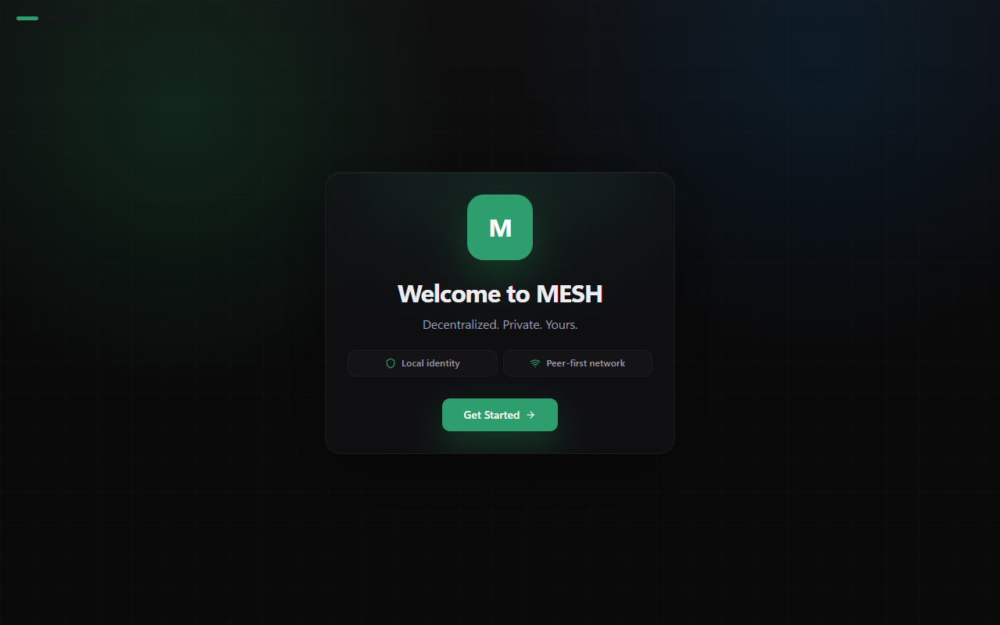
  <br/>
  <em>Welcome screen — Decentralized. Private. Yours.</em>
</p>

---

## 🔗 The Same-Host Model

MESH deliberately scopes social features to a single host, because a host *is* the shared space:

- **Friends** can only be added between two people connected to the **same host**. Friend requests are delivered through the host's user registry; a request to someone who isn't on your host is never delivered (and can't be self-accepted).
- **Voice / video calls** (1-on-1) connect **only** when both parties are on the same host. The call invite is routed through the host, and the media room lives inside the host that relays it.
- **Server voice channels** work the same way — the host relays media to every member in the channel.
- **Nearby discovery** shows everyone currently announced on your host, symmetrically (both parties always see each other).

You can **host and connect to another host at the same time**, and even host on **multiple ports** simultaneously.

---

## ✨ Features

### 💬 Direct Messaging
- **1-on-1 conversations** delivered through your shared host
- **Message reactions** with emoji support
- **File attachments** up to 50 MB with drag-and-drop support
- **Message editing** and deletion with edit history indicators
- **Online / Idle / Offline** status indicators for all friends
- **User profile panel** with mutual servers, user ID, and quick-access message button

<p align="center">
  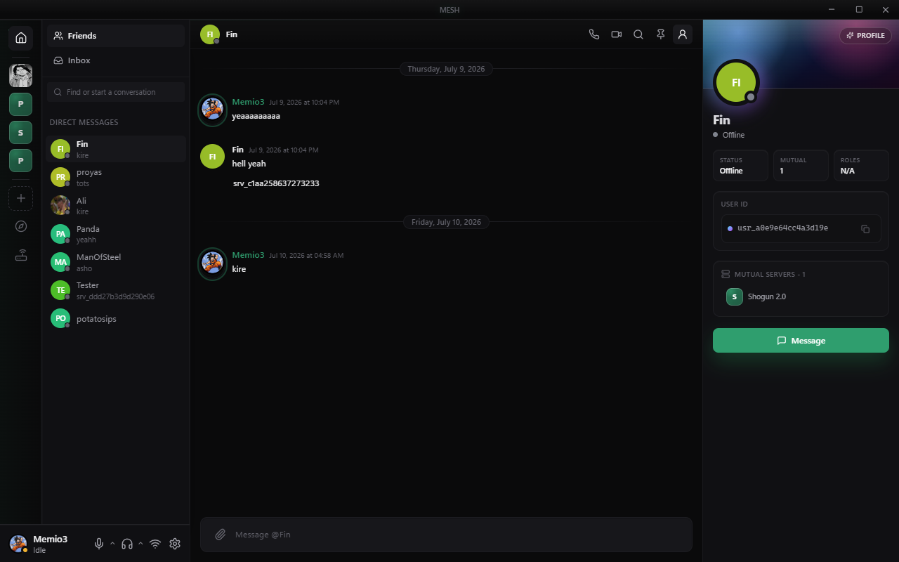
  <br/>
  <em>1-on-1 DM view — real-time messages with profile panel, call/video buttons, and code block rendering</em>
</p>

---

### 👥 Friend Management
- **Add friends** using their unique User ID — **same-host only** (mandatory)
- **Friend requests** with accept-incoming-only workflow (no self-accept)
- **Nearby users** discovery on the current host, kept symmetric via host-pushed presence snapshots
- **Blocked users** management panel
- **Online friends** quick-access list with status indicators

<p align="center">
  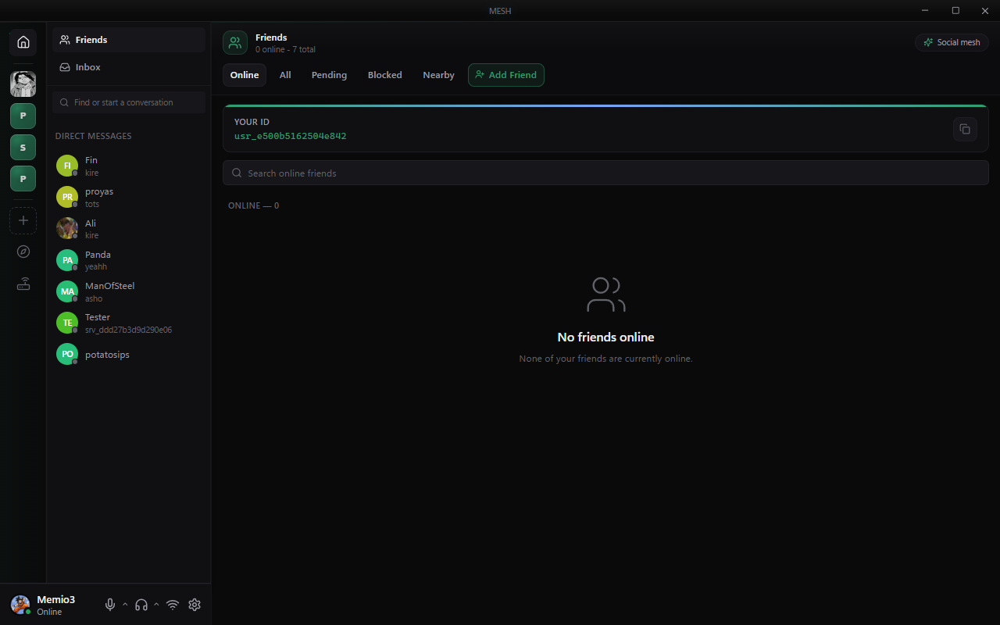
  <br/>
  <em>Friends page — Online tab with Your ID banner and DM sidebar</em>
</p>

<p align="center">
  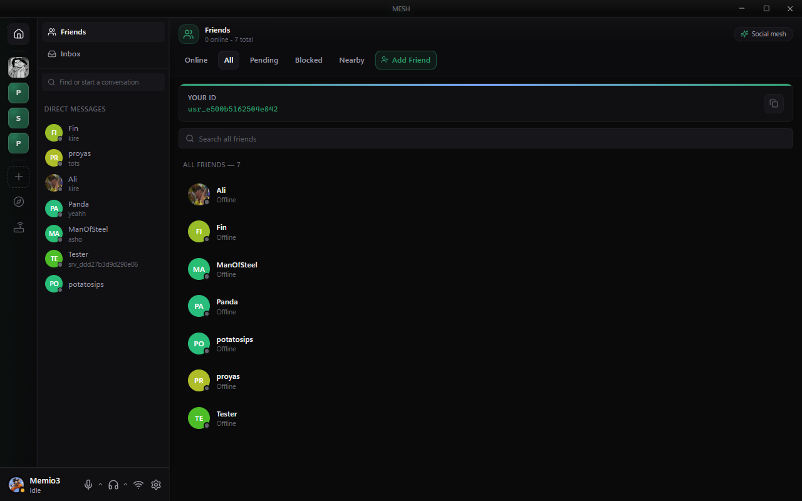
  <br/>
  <em>Friends page — All tab showing your 7 friends with offline/online status</em>
</p>

---

### 📨 Message Requests
- **Cold messaging** for non-friends (similar to Discord message requests)
- **Thread-based conversations** before accepting friend requests
- **Accept / Ignore / Block** options for incoming requests
- **Preview snippets** showing the first message

---

### 🏠 Community Servers
- **Host your own server** with customizable name and icon
- **Text channels** organized into collapsible categories
- **Voice rooms** with host-relayed audio and video
- **Custom roles** with a Discord-style per-role permission matrix
- **Per-channel permission overrides** (allow / inherit / deny, per role)
- **Channel settings**: bitrate, user limit, and permission controls
- **Member list** with live presence indicators, host badge, and search
- **Code block rendering** with syntax highlighting (Java, Python, etc.)

<p align="center">
  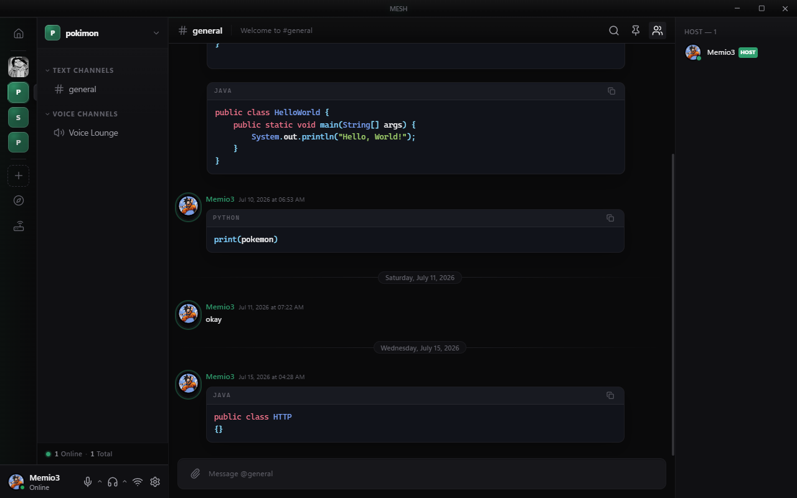
  <br/>
  <em>Server text channel — code blocks with syntax highlighting, voice lounge, and member list</em>
</p>

<p align="center">
  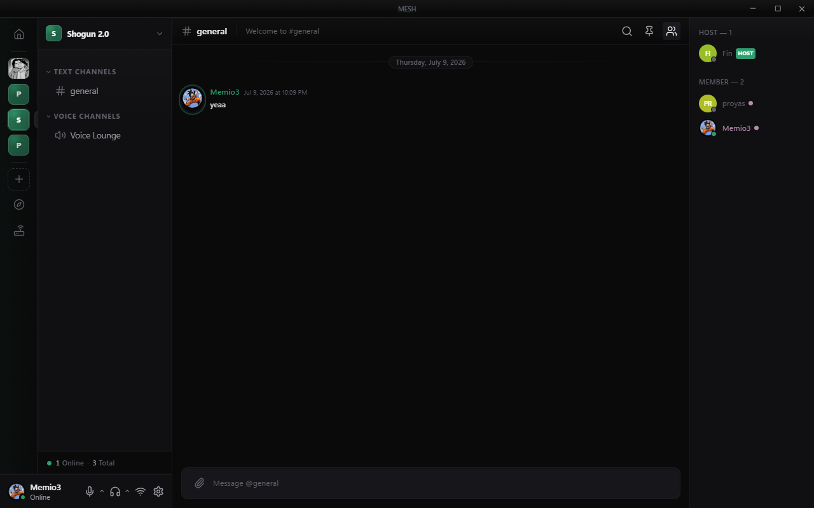
  <br/>
  <em>Shogun 2.0 server — member list with host badge, text & voice channels</em>
</p>

---

### 📞 Voice & Video Calls
- **1-on-1 voice calls** (same-host only), host-relayed
- **Video calls** with camera selection
- **Screen sharing** (window or full-screen)
- **Picture-in-picture** self-preview during calls
- **Audio device selection** with input volume control
- **Mute / unmute** and camera toggle controls, with camera-off state relayed to the peer
- **Graceful timeout** if the callee can't be reached (e.g. not on the same host)

---

### 🔒 Privacy & Security
- **Cryptographic identity** using Ed25519 keypairs
- **Local-only storage** for all messages and user data
- **No central database** storing user information
- **Runs on your own network** — LAN / intranet / CGNAT, no public backbone required
- **Optional visibility** toggle to hide from discovery
- **Block users** system-wide across DMs and servers

<p align="center">
  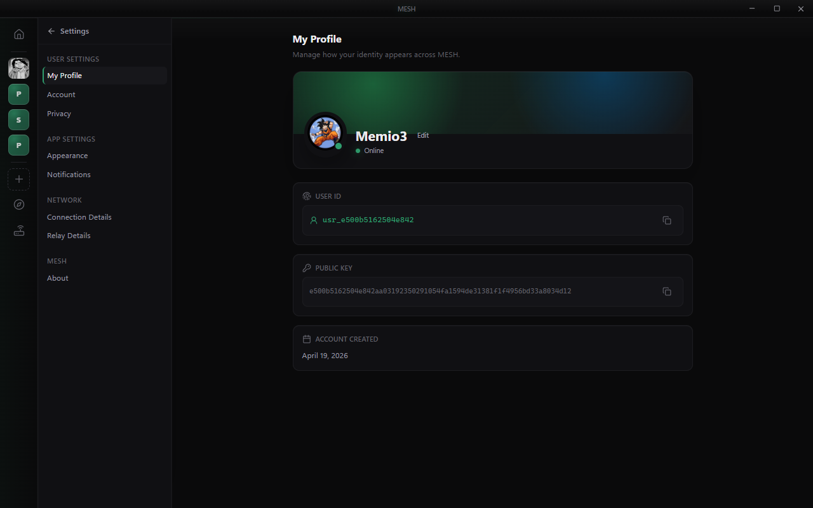
  <br/>
  <em>User profile — Ed25519 public key, User ID, and account creation date</em>
</p>

---

### 🌍 Discovery & Networking
- **Multi-network discovery** of servers across your connected hosts
- **Active network** indicator showing your current host and latency
- **Server browser** with member counts and "Open" quick-access
- **Connect to additional hosts** by IP address

<p align="center">
  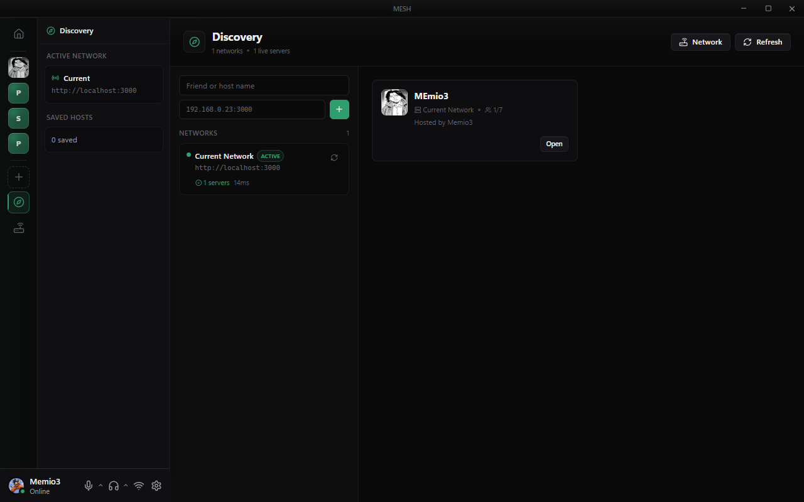
  <br/>
  <em>Discovery — browse live servers across your connected networks</em>
</p>

---

### 🖧 Network Center
- **Connection dashboard** with real-time latency monitoring
- **Host toggle** — become a host with one switch
- **Multi-port hosting** — run several hosts from one instance
- **Hosting endpoints** with shareable invite links and automatic route detection
- **Internet route detection** for automatic port forwarding
- **My Servers** panel with per-server hosting port assignment and live/stopped toggle

<p align="center">
  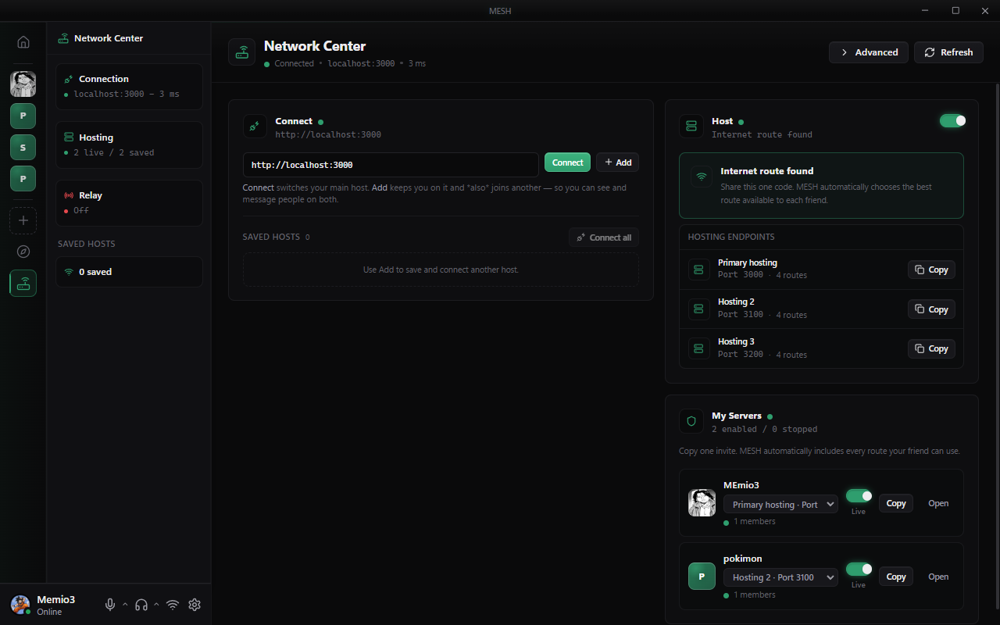
  <br/>
  <em>Network Center — multi-port hosting (3000, 3100, 3200), internet route found, live server management</em>
</p>

---

### 🎨 Customization
- **Profile customization** with username and avatar upload
- **19 color themes** across Featured, Dark, and Vivid categories (Crimson, Obsidian, Midnight, Aurora, Ocean, Violet…)
- **Font size** adjustment with live preview
- **Chat density** control (Compact / Default / Cozy)
- **Message grouping** interval configuration
- **5 animation personalities** — Smooth, Luxe, Snappy, Playful, Calm
- **Notification preferences** per conversation type

<p align="center">
  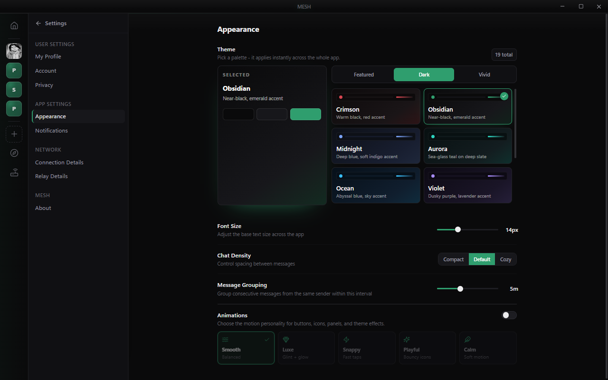
  <br/>
  <em>Appearance — 19 themes, font size, chat density, message grouping, and animation styles</em>
</p>

---

## 🏗 Architecture

### Technology Stack

```
┌─────────────────────────────────────────────────────────────┐
│                         MESH Architecture                    │
├─────────────────────────────────────────────────────────────┤
│  Renderer (React 19)           Main Process (Electron)       │
│  ├─ Components                  ├─ IPC Handlers               │
│  ├─ Pages                       ├─ SQLite Database            │
│  ├─ Stores (Zustand)            ├─ Socket Client (routing)    │
│  └─ Media Engine (WebCodecs)    └─ Signaling Host (per port)  │
│                                                              │
│  Signaling Server (Socket.IO)                                │
│  ├─ Presence / Discovery                                     │
│  ├─ Message & Media Relay                                    │
│  └─ Server & Room Coordination                               │
└─────────────────────────────────────────────────────────────┘
```

### Process Model

| Process | Technology | Responsibility |
|---------|------------|----------------|
| **Renderer** | React 19 + Vite | UI, media capture/encode/decode via WebCodecs |
| **Main** | Electron | Window management, IPC, database, socket routing, signaling host |
| **Preload** | TypeScript | Secure bridge between renderer and main |
| **Signaling** | Socket.IO | Presence, message relay, media relay, room coordination |

### Media Path (host-relayed, no WebRTC)

```
                        ┌──────────────┐
   mic  → Opus  ─┐      │              │      ┌─ Opus  → speakers
                 ├─►  SEND ► HOST ► FANOUT  ◄─┤
  cam/screen→VP8─┘      │  (Socket.IO) │      └─ VP8   → <canvas>/<video>
                        └──────────────┘
```

- The renderer's `MeshMediaEngine` encodes mic audio to **Opus** and camera/screen to **VP8** (periodic keyframes) using the browser's `AudioEncoder` / `VideoEncoder`.
- Encoded frames are sent as **binary Socket.IO messages** to the host.
- The **host relays** each frame to every other member of the media room.
- Receivers decode frames back into `MediaStream`s (a `MediaStreamAudioDestinationNode` for audio, a `canvas.captureStream()` for video).
- There is a single active media room at a time; joining a call leaves any active voice channel first.

### Data Flow

#### Direct Message
```
User A → Host (Socket.IO) → User B
```

#### Server Message
```
User A → Host (Socket.IO) → All Server Members
         (broadcast via Socket.IO rooms)
```

#### Voice / Video (same host)
```
User A → Host (relay) → User B     (and vice-versa)
         binary Opus / VP8 frames
```

### Multi-Host Routing

A single MESH instance can host and connect at once. The main-process socket client keeps a **primary socket** plus a map of **auxiliary sockets** (one per remote host). Events like `server:*`, `join-room` / `leave-room`, `media:*`, and `stream:*` are routed to the correct socket — the local-host socket when you host that server, otherwise the primary connection.

### Database Schema

MESH uses SQLite (via `better-sqlite3`) for local storage:

| Table | Purpose |
|-------|---------|
| `friends` | Friend list with status |
| `friend_requests` | Pending friend requests |
| `message_requests` | Cold message threads |
| `conversations` | DM conversation metadata |
| `messages` | DM message history |
| `servers` | Joined/hosted servers |
| `server_members` | Server membership |
| `server_channels` | Server text/voice channels |
| `server_messages` | Server message history |
| `blocked_users` | Blocked user list |
| `settings` | User preferences |

---

## 📥 Installation

### Windows

Download the latest installer from the [Releases](https://github.com/MEmio3/_MESH_/releases) page:

```
MESH-Setup-0.1.13.exe
```

**System Requirements:**
- Windows 10 or later (64-bit)
- 500 MB free disk space
- A LAN / intranet connection (public internet not required)

### Linux

```bash
# AppImage (recommended)
chmod +x MESH-0.1.13.AppImage
./MESH-0.1.13.AppImage

# Debian/Ubuntu
sudo dpkg -i MESH-0.1.13.deb
```

---

## 🛠 Development

### Prerequisites

- **Node.js** 20.x or later
- **npm** or **pnpm**
- **Git**

### Setup

```bash
# Clone the repository
git clone https://github.com/MEmio3/_MESH_.git
cd _MESH_

# Install dependencies
npm install

# Start development server
npm run dev
```

### Available Scripts

| Command | Description |
|---------|-------------|
| `npm run dev` | Start Electron in development mode |
| `npm run dev:user2` | Start a second instance (separate user data) |
| `npm run build` | Build for production |
| `npm run dist` | Create Windows distributable installer |
| `npm run dist:linux` | Build Linux packages (AppImage + deb) |
| `npm run signaling` | Run standalone signaling server |

### Project Structure

```
MESH/
├── src/
│   ├── main/                    # Electron main process
│   │   ├── index.ts             # Entry point, window creation
│   │   ├── ipc-handlers.ts      # IPC handler registration
│   │   ├── database.ts          # SQLite operations
│   │   ├── identity.ts          # Ed25519 cryptographic identity
│   │   ├── socket-client.ts     # Signaling client + multi-host routing
│   │   ├── signaling-host.ts    # Embedded signaling host(s), per port
│   │   ├── network-scanner.ts   # IP/CGNAT detection + UPnP
│   │   ├── avatar.ts            # Avatar file handling
│   │   └── file-manager.ts      # File transfer handling
│   │
│   ├── renderer/                # React renderer process
│   │   ├── src/
│   │   │   ├── components/      # Reusable UI components
│   │   │   ├── pages/           # Application pages
│   │   │   │   ├── welcome/     # Onboarding flow
│   │   │   │   ├── friends/     # Friends list & management
│   │   │   │   ├── dm/          # Direct message conversations
│   │   │   │   ├── server/      # Community server view
│   │   │   │   ├── discovery/   # Network & server discovery
│   │   │   │   ├── network-center/ # Hosting & connection dashboard
│   │   │   │   ├── inbox/       # Unified inbox
│   │   │   │   └── settings/    # User & app settings
│   │   │   ├── stores/          # Zustand state stores
│   │   │   ├── hooks/           # Custom React hooks
│   │   │   ├── lib/             # Utilities (media-engine, etc.)
│   │   │   └── types/           # TypeScript type definitions
│   │   └── index.html
│   │
│   ├── preload/                 # Preload scripts
│   │   ├── index.ts             # Context bridge
│   │   └── index.d.ts           # Type definitions
│   │
│   ├── server/                  # Signaling server
│   │   └── signaling.ts         # Factory: createSignalingInstance
│   │
│   └── shared/                  # Shared types & permission logic
│       ├── types.ts
│       └── permissions.ts
│
├── resources/                   # App icons and assets
├── images/                      # Documentation screenshots
├── release/                     # Build output
├── package.json
├── electron.vite.config.ts
└── tsconfig.json
```

---

## ⚙ Configuration

### Network Settings

Access via **Settings → Connection Details**:

| Setting | Description | Default |
|---------|-------------|---------|
| Signaling URL | Host to connect to for discovery/relay | `http://localhost:3000` |
| Self-host signaling | Run an embedded signaling host | Off |
| Extra host ports | Additional ports to host on simultaneously | — |

<p align="center">
  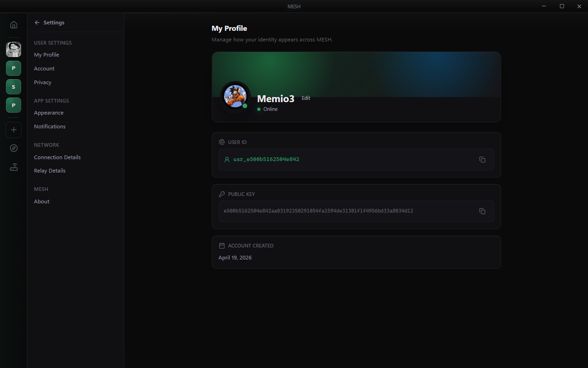
  <br/>
  <em>Connection Details — signaling URL, hosting toggle, and relay configuration</em>
</p>

---

## 🔐 Security Considerations

### Identity Generation

MESH generates an Ed25519 keypair on first launch:
- **Public key**: Used as your User ID (shared with others)
- **Private key**: Encrypted and stored locally, never transmitted
- **Signing**: Messages can be cryptographically signed

### Storage

| Data Type | Location | Encrypted |
|-----------|----------|-----------|
| Identity | `userData/identity.enc` | Yes (OS-level) |
| Messages | `userData/mesh.db` | No (local only) |
| Avatars | `userData/avatars/` | No (local only) |
| Files | `userData/files/` | No (local only) |

### Network Security

- All coordination and media flow over Socket.IO to the host — nothing traverses the public internet unless your host is on it.
- The host relays media in memory; **no message or media content is persisted** on the signaling host.
- Social features (friends, calls) are scoped to the host you're connected to.

---

## 🔧 Troubleshooting

### Connection Issues

**Cannot connect to a host:**
1. Verify the signaling URL in Settings → Connection Details
2. Enable "Self-host signaling" to run your own host locally
3. Check firewall rules for the host port (default: 3000, plus any extra host ports)

**Can't see someone / can't add them as a friend:**
1. Confirm you are both connected to the **same host** — this is required
2. Check they aren't blocked
3. Use the Nearby refresh; presence is host-pushed and symmetric

**Call won't connect:**
1. Both parties must be on the **same host** — cross-host calls are not delivered
2. Outgoing calls time out after ~30s if the callee can't be reached

### Build Issues

**Native module errors:**
```bash
npm run postinstall
# Or manually rebuild
npx electron-rebuild
```

**TypeScript errors:**
```bash
npx tsc --noEmit
```

---

## 🤝 Contributing

Contributions are welcome! Please follow these guidelines:

1. **Fork the repository** and create a feature branch
2. **Follow the code style** (ESLint + Prettier)
3. **Test thoroughly** before submitting PR
4. **Document new features** in this README

### Architecture Deep Dive

For maintainers and contributors interested in the inner workings of our signaling layer, media transport topology, and the roadmap for true offline-first communication (intranet, CGNAT, Wi-Fi cluster), please read the [MESH Deep Dive](docs/MESH_DEEP_DIVE.md) document.

### Areas for Contribution

- [ ] End-to-end encryption for messages
- [ ] Group DM support
- [ ] Cross-host federation for social features
- [ ] Mobile application
- [ ] Bots and integrations API
- [ ] Message search functionality

---

## 📄 License

MIT License — See [LICENSE](LICENSE) for details

---

## 🙏 Acknowledgments

MESH is inspired by:
- [Discord](https://discord.com) — Server and channel structure
- [TeamSpeak](https://www.teamspeak.com) — Self-hosted, host-centric model
- [Session](https://getsession.org) — Privacy-focused messaging

Built with:
- [Electron](https://www.electronjs.org/)
- [React](https://react.dev/)
- [Socket.IO](https://socket.io/)
- [WebCodecs](https://developer.mozilla.org/en-US/docs/Web/API/WebCodecs_API)
- [better-sqlite3](https://github.com/JoshuaWise/better-sqlite3)
- [Zustand](https://zustand-demo.pmnd.rs/)
- [Framer Motion](https://www.framer.com/motion/)
- [Lucide Icons](https://lucide.dev/)
- [libsodium](https://doc.libsodium.org/)

---

<div align="center">

**MESH** — Host it yourself. Stay private.

Made with ❤️ by [MEmio3](https://github.com/MEmio3) · Contact: maruf.hossain1@g.bracu.ac.bd

[Report Bug](https://github.com/MEmio3/_MESH_/issues) · [Request Feature](https://github.com/MEmio3/_MESH_/issues)

</div>
